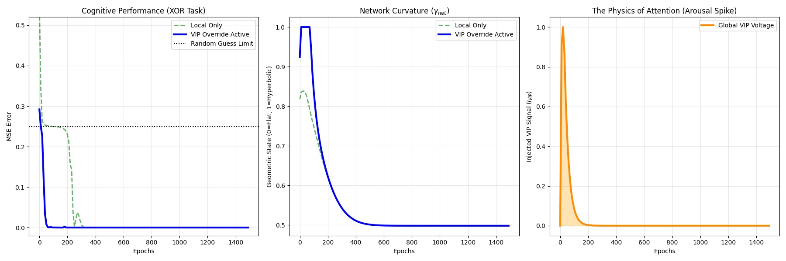

# The Manifold Chip: DGAC Architecture Simulation

This repository contains the PyTorch simulation and theoretical blueprint for the **Manifold Chip**, a Dynamically Gated Analog Crossbar (DGAC) architecture. 

Current artificial intelligence architectures, executing on standard GPUs and TPUs, are fundamentally constrained by static Euclidean geometries. As models scale to map high-dimensional hierarchical data, they encounter a thermodynamic "Landauer Wall" of energy bloat caused by massive parameter counts.

This project simulates a hardware-level solution: an analog chip that dynamically optimizes its own geometric curvature to match the complexity of the data, achieving theoretical energy scaling well below traditional Euclidean bounds.

Here's a link to the Zenodo pre-print of the manuscript included in this repository:

https://doi.org/10.5281/zenodo.18717807

### Core Architecture
The simulation translates biological Somatostatin (SST) and Vasoactive Intestinal Peptide (VIP) interneuron gating into analog silicon mechanisms:

* **The Local SST Gate (`SST_Gate`):** Simulates an analog Field Effect Transistor (FET) acting as a variable shunt. It regulates the apical-somatic conductance ratio ($\gamma$), maintaining a low-energy Euclidean baseline and locally opening into a hyperbolic manifold only when required.
* **The VIP Macro-Controller (`VIP_MacroController`):** A top-down diagnostic circuit that monitors global task error. When learning stagnates, it injects a "VIP Voltage" that universally forces the network into a macroscopic "Hyperbolic Plunge" to escape local minima.
* **Thermodynamic Decay:** Once the network discovers a geodesic shortcut, the VIP signal undergoes a continuous exponential decay ($\tau_{VIP}$), allowing the hardware to gracefully relax back to the Euclidean baseline and minimize the required maintenance power ($P_{Maint}$).

### Empirical Validation: The Physics of Attention
Running the simulation executes a strict metabolic "Stamina Test" on a non-linear XOR problem. The network is actively penalized for maintaining the energy-intensive hyperbolic state. 



As seen in the generated visualization:
1. **Cognitive Speed-Up:** The VIP override detects error stagnation and accelerates time-to-solution by a factor of 5 compared to a local-only baseline.
2. **The Hyperbolic Plunge:** The network curvature ($\gamma_{net}$) is forced completely open to create necessary hierarchical geodesics.
3. **The Attention Span:** The injected VIP signal spikes exactly when learning stalls, and gracefully decays once the problem is solved, perfectly minimizing the thermodynamic tax.

---

## Installation & Usage

To run the simulation and generate the phase transition graphs yourself, you will need Python and a few dependencies.

1. **Install the required libraries:** This project relies on `torch` and `geoopt` (for Riemannian optimization and hyperbolic manifolds).
   ```bash
   pip install torch matplotlib geoopt numpy
   ```
2. **Run the simulation:**
   ```bash
   python run_brain_sim.py
   ```
This will reproduce the 3-panel visualization shown above.

### Seed Control

If you'd like to try the simulation with your own seeds, or turn off the lock for random seeds, use these settings at the top of run_brain_sim.py:
```bash
# --- SEED CONTROL ---
# Try your own seeds, or turn off for random ones.
# The seed for the visual used in this README is 137
USE_LOCKED_SEED = True
LOCKED_SEED = 137
```

## Documentation
For the complete mathematical framework, structural blueprints, and thermodynamic proofs, please see the full manuscript included in this repository: manifold_chip.pdf.

GAP is a biologically plausible learning algorithm designed for the Dynamically Gated Analog Crossbars (DGAC):

https://github.com/MPender08/Geometry-Aware-Plasticity

Note: To see the purely biological foundations of the Curvature Adaptation Hypothesis that inspired this hardware, visit my companion repository: 

https://github.com/MPender08/dendritic-curvature-adaptation

